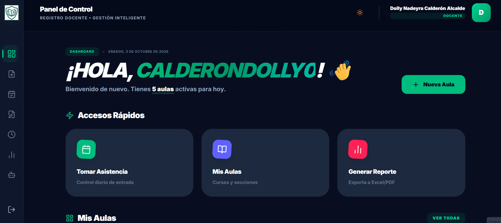
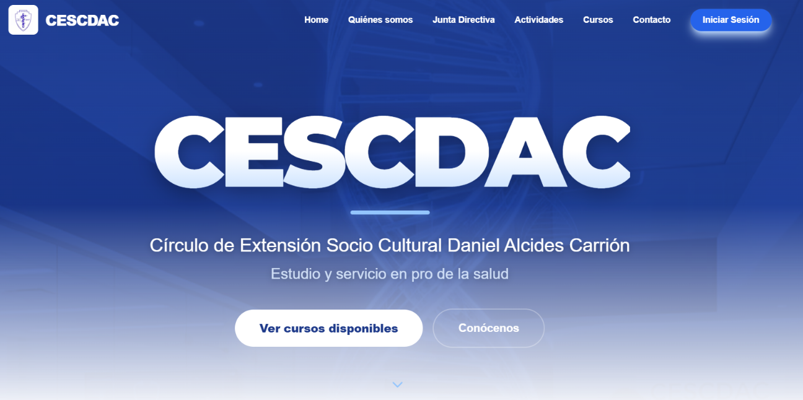

# Hola, soy Adriel Zumaeta 👋

### Desarrollador Full Stack · Automatizaciones · Inteligencia Artificial

*Software útil para educación y gestión.*

---

## 👨‍💻 Sobre mí

Soy estudiante de **Ingeniería de Sistemas (8.º ciclo)** en Trujillo, Perú. Construyo aplicaciones web y PWA que resuelven problemas reales en educación y gestión, integrando **inteligencia artificial** y **automatización** donde aportan valor.

- 🎯 Busco **trabajo, prácticas y proyectos freelance**.
- 🗣️ Español nativo · Inglés intermedio.
- ⚽ Fuera del código, me encanta ver y practicar todo tipo de deportes.

---

## 🚀 Proyectos destacados

### 📚 [RegistroDocente2026](https://registrodocente2026.netlify.app/)
PWA para docentes que centraliza su trabajo diario:
- Registro de **notas y asistencias**.
- **Gráficos** de niveles de logro de los estudiantes (AD, A, B, C).
- **Asistente de IA** que ayuda a elaborar sesiones e informes con base en el **Currículo Nacional**.

`JavaScript` `HTML` `CSS` `Firestore` `PWA` `IA` `Netlify`

  

### 🎓 [CescDac](https://cescdac.com)
Plataforma web para una asociación de estudiantes de la UNT. Permite la **inscripción a cursos**, la **consulta de notas** y el **registro de pagos** subiendo la captura del comprobante.

  

### 🩺 [examen-pwa](https://github.com/zumaetaadriel2/examen-pwa)
PWA de práctica de exámenes de medicina para el **Residentado Médico**. Repositorio público.

### ⛪ App de pastoral *(en desarrollo)*
Aplicación para la asistencia a misa con interacción tipo *swipe* para aceptar fotos y mapa con la **ubicación de iglesias**.

### ⚖️ Asistente de IA legal *(próximamente)*
Proyecto futuro: agentes de IA para análisis y asistencia legal.

---

## 🛠️ Tecnologías

**Lo que uso:**

**Lo que estoy aprendiendo:**

- 🤖 Agentes de IA y *skills*
- ☁️ Cloud con **AWS**
- 🖥️ Despliegue en **VPS**

---

## 📊 GitHub

---

## 📫 Contacto

¿Tienes un proyecto, una oportunidad o quieres colaborar? Escríbeme:

- 💼 [LinkedIn](https://www.linkedin.com/in/adriel-augusto-zumaeta-calder%C3%B3n/)
- 📧 [zumaetaadriel2@gmail.com](mailto:zumaetaadriel2@gmail.com)
